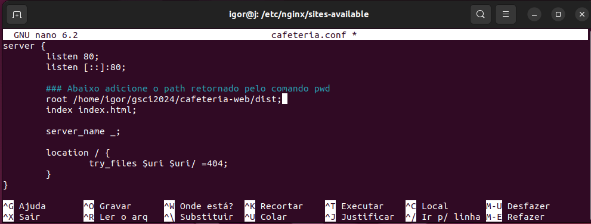

<h1 align="center">Configuração de redirecionamento no Nginx e Teste de carga com Apache Bench</h1>

> ⚠️ AVISO: Todos os comandos utilizados neste repositório foram realizados em uma distribuição Linux Ubuntu.

### Etapa 1 – Instalando o Nginx

>      $ sudo apt update
>      $ sudo apt install nginx -y

### Etapa 2 – Ajustando o Firewall

Primeiro, ative o firewall com o comando:
    
>      $ sudo ufw enable

  

Liste as configurações do aplicativo utilzando o comando:

>      $ sudo ufw app list

Você deve obter uma lista dos perfis de aplicativos:

  

- Nginx Full : Este perfil abre a porta 80 (tráfego da web normal e não criptografado) e a porta 443 (tráfego criptografado TLS/SSL)

- Nginx HTTP : Este perfil abre apenas a porta 80 (tráfego da web normal e não criptografado)

- Nginx HTTPS : Este perfil abre apenas a porta 443 (tráfego criptografado TLS/SSL)

> ⚠️ AVISO: É recomendado que você habilite o perfil mais restritivo que ainda permitirá o tráfego que você configurou. Mas no momento, só precisaremos permitir tráfego na porta 80.
Você pode habilitar isso digitando:

>      $ sudo ufw allow 'Nginx HTTP'

  

Você pode verificar a alteração digitando:

>      $ sudo ufw status

  

  ### Etapa 3 – Configurando o seu projeto
Crie um diretório chamado "gcsi2024" no **/home/<usuário>** e entre no diretório criado digitando:

>      $ mkdir gcsi2024 && cd gsci2024

Clone o projeto cafeteria-web dentro do diretório "gcsi2024":

>      $ git clone https://github.com/rhavymaia/cafeteria-web.git

   ou, clone via SSH

>     $ git clone git@github.com:rhavymaia/cafeteria-web.git

  

Instale as dependências do projeto digitando:

>      $ npm i

Compile o projeto digitando: 

>      $ npm run build

### Etapa 4 – Configuração de redirecionamento no Nginx

Dentro do projeto, navegue até o diretório **dist/** e utilize o comando pwd para retornar o path completo, para isso, utilize os comandos:

>     $ ls
>     $ cd dist/
>     $ pwd

  

Crie um arquivo .conf dentro do diretório **/etc/nginx/sites-available/** digitando:

>     $ cd /etc/nginx/sites-available/
>     $ sudo nano cafeteria.conf

  

Adicione as seguintes configurações no arquivo cafeteria.conf:

  

> ⚠️ AVISO: Antes de sair do nano certifique-se de salvar as alterações feitas! Utilize **Ctrol + o** para salvar as alterações e **Ctrol + x** para sair.

Navegue até o diretório **/etc/nginx/** e altere o usuário **“user www-data”** para **“user <usuário>”**, para isso, utilize:
	    
>     $ ls
>     $ sudo nano nginx.conf

  

Alterando **“user www-data”** para **“user igor”**:

  

Navegue até **/etc/nginx/sites-enabled** e crie um link simbólico no diretório atual, apontando para o arquivo **cafeteria.conf**, localizado no diretório **../sites-available/** e remova o arquivo default, para isso, utilize os seguintes comandos:

>     $ cd /etc/nginx/sites-enabled
>     $ ls
>     $ sudo ln -s ../sites-available/cafeteria.conf .
>     $ ls
>     $ sudo rm default
>     $ ls
    
> ⚠️ AVISO: Certifique-se de utilizar a permisão de super usuário para remover o **default**, caso o contrário a permissão será negada como no exemplo abaixo!

  

Reinicie o Nginx, para isso utilize os seguintes comandos:

>     $ sudo systemctl restart nginx

ou, se o comando **restart** não funcionar, tente estes: 

>     $ sudo systemctl stop nginx
>     $ sudo systemctl status nginx
>     $ sudo systemctl start nginx

  

Se todos os passos foram seguidos corretamente até aqui, ao abrir o **localhost** no seu browser deve aparecer a seguinte aplicação:

  