<h1 align="center">Configuração de redirecionamento no Nginx e Teste de carga com Apache Bench</h1>

> ⚠️ AVISO: Todos os comandos utilizados neste repositório foram realizados em uma distribuição Linux Ubuntu.

  <a href="#etapa1">Etapa 1 – Instalando o Nginx</a>&nbsp;&nbsp;&nbsp;|&nbsp;&nbsp;&nbsp;
  <a href="#etapa2">Etapa 2 – Ajustando o Firewall</a>&nbsp;&nbsp;&nbsp;|&nbsp;&nbsp;&nbsp;
  <a href="#etapa3">Etapa 3 – Configurando o seu projeto</a>&nbsp;&nbsp;&nbsp;|&nbsp;&nbsp;&nbsp;
  <a href="#etapa4">Etapa 4 – Configuração de redirecionamento no Nginx</a>&nbsp;&nbsp;&nbsp;| &nbsp;&nbsp;&nbsp;
  <a href="#etapa5">Etapa 5 – Teste de carga com Apache Bench</a>&nbsp;&nbsp;&nbsp;&nbsp;&nbsp;&nbsp;

### Etapa 1 – Instalando o Nginx

>       sudo apt update
>       sudo apt install nginx -y

### Etapa 2 – Ajustando o Firewall

Primeiro, ative o firewall com o comando:
    
>       sudo ufw enable

  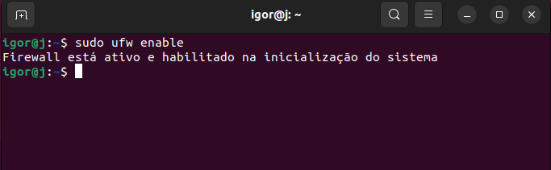

Liste as configurações do aplicativo utilzando o comando:

>       sudo ufw app list

Você deve obter uma lista dos perfis de aplicativos:

  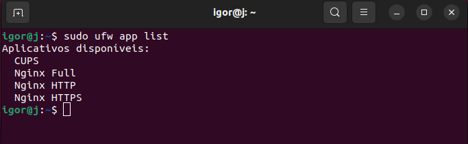

- Nginx Full : Este perfil abre a porta 80 (tráfego da web normal e não criptografado) e a porta 443 (tráfego criptografado TLS/SSL)

- Nginx HTTP : Este perfil abre apenas a porta 80 (tráfego da web normal e não criptografado)

- Nginx HTTPS : Este perfil abre apenas a porta 443 (tráfego criptografado TLS/SSL)

> ⚠️ AVISO: É recomendado que você habilite o perfil mais restritivo que ainda permitirá o tráfego que você configurou. Mas no momento, só precisaremos permitir tráfego na porta 80.
Você pode habilitar isso digitando:

>       sudo ufw allow 'Nginx HTTP'

  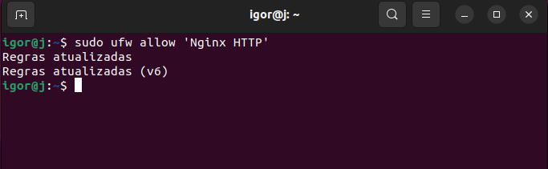

Você pode verificar a alteração digitando:

>       sudo ufw status

  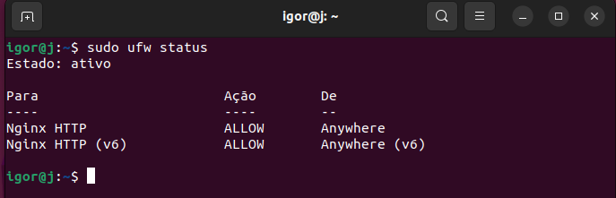

### Etapa 3 – Configurando o seu projeto
Crie um diretório chamado **gcsi2024** no **/home/<usuário>** e entre no diretório criado digitando:

>       mkdir gcsi2024 && cd gsci2024

Clone o projeto **[cafeteria-web](https://github.com/rhavymaia/cafeteria-web)** dentro do diretório **gcsi2024**:

>       git clone https://github.com/rhavymaia/cafeteria-web.git

   ou, clone via SSH

>      git clone git@github.com:rhavymaia/cafeteria-web.git

  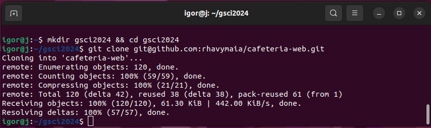

Instale as dependências do projeto digitando:

>      $ npm i

Compile o projeto digitando: 

>       npm run build

### Etapa 4 – Configuração de redirecionamento no Nginx

Dentro do projeto, navegue até o diretório **dist/** e utilize o comando **pwd** para retornar o path completo, para isso, utilize os comandos:

>      ls
>      cd dist/
>      pwd

  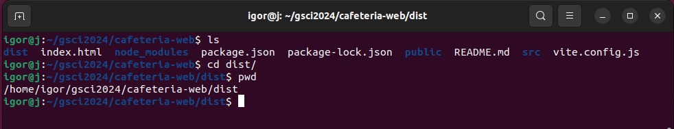

Crie um arquivo **.conf** dentro do diretório **/etc/nginx/sites-available/** digitando:

>      cd /etc/nginx/sites-available/
>      sudo nano cafeteria.conf

  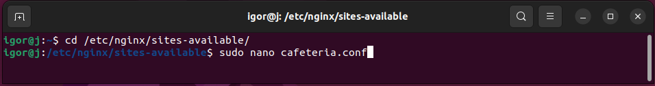

Adicione as seguintes configurações no arquivo **cafeteria.conf**:

>  ⚠️ AVISO: Para copiar as configurações abaixo, [clique aqui!](https://github.com/ignizxl/gcsi-tutorial/blob/main/src/cafeteria.conf)

  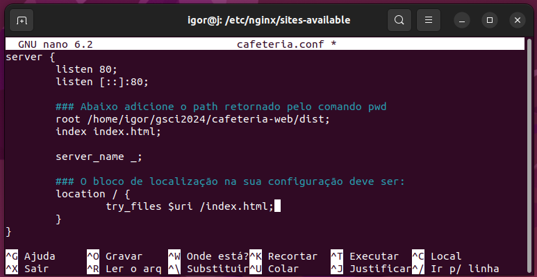

> ⚠️ AVISO: Antes de sair do nano certifique-se de salvar as alterações feitas! Utilize **Ctrol + o** para salvar as alterações e **Ctrol + x** para sair.

Navegue até o diretório **/etc/nginx/** e altere o usuário **“user www-data”** para **“user <usuário>”**, para isso, utilize:
	    
>      ls
>      sudo nano nginx.conf

  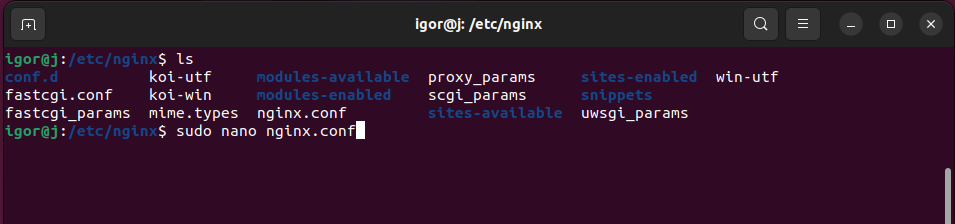

Alterando **“user www-data”** para **“user igor”**:

  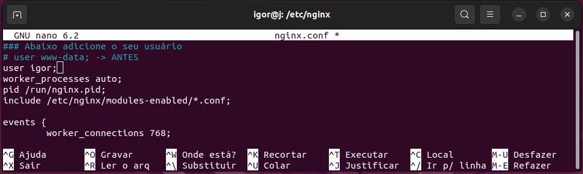

Navegue até **/etc/nginx/sites-enabled** e crie um link simbólico no diretório atual, apontando para o arquivo **cafeteria.conf**, localizado no diretório **../sites-available/** e remova o arquivo default, para isso, utilize os seguintes comandos:

>      cd /etc/nginx/sites-enabled
>      ls
>      sudo ln -s ../sites-available/cafeteria.conf .
>      ls
>      sudo rm default
>      ls
    
> ⚠️ AVISO: Certifique-se de utilizar a permisão de super usuário para remover o **default**, caso o contrário a permissão será negada como no exemplo abaixo!

  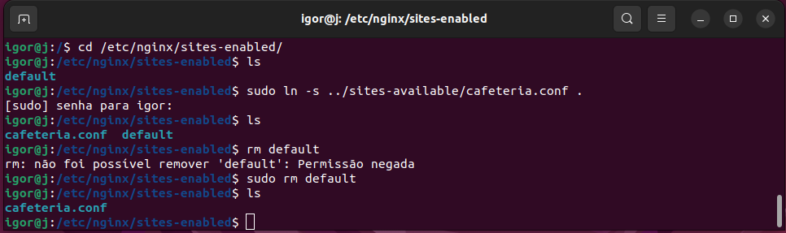

Reinicie o Nginx, para isso utilize os seguintes comandos:

>      sudo systemctl restart nginx

ou, se o comando **restart** não funcionar, tente estes: 

>      sudo systemctl stop nginx
>      sudo systemctl status nginx
>      sudo systemctl start nginx

  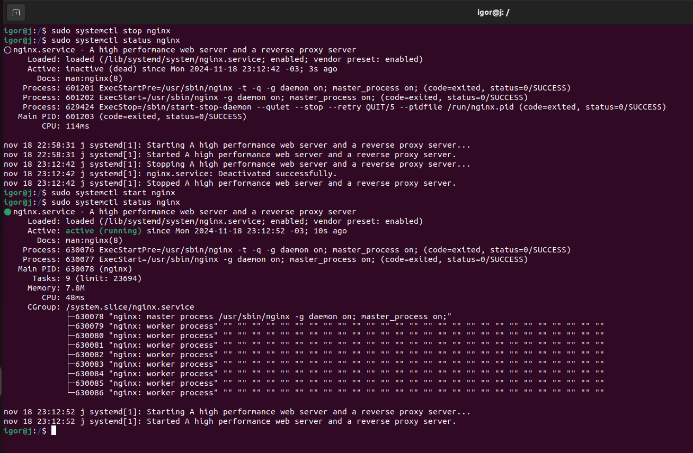

Se todos os passos foram seguidos corretamente até aqui, ao abrir o **localhost** no seu browser deve aparecer a seguinte aplicação:

  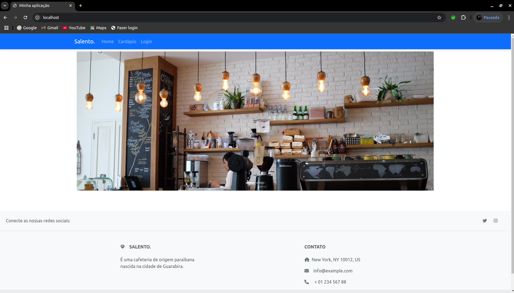

### Etapa 5 – Teste de carga com Apache Bench

Instale o Apache Bench digitando: 

>       sudo apt update
>       sudo apt install apache2-utils -y

Depois disso, verificamos a instalação por:
>       ab -V

O comando acima produziu uma saída como a mostrada abaixo:

  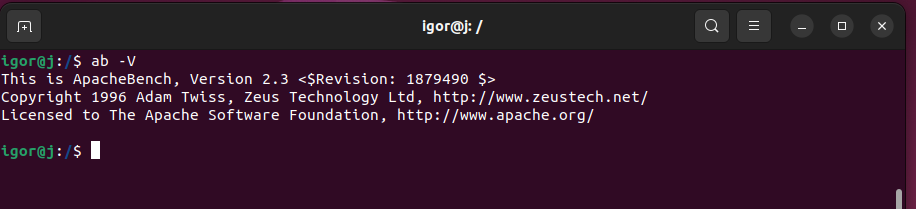

Teste básico com o **Apache Bench**

> Primeiramente, faremos um teste básico utilizando a opção **-n**, que permite definir o número de requisições que você deseja enviar. Sem essa opção, o comando enviará apenas uma única requisição. Execute o comando abaixo para enviar **10 requisições individuais**, o que não deve ser difícil para o seu servidor processar. Este é um bom ponto de partida para comparar resultados futuros.

>      ab -n 10 "https://example.com/"

Aumentar o Número de Requisições Enviadas:

> Agora que você já sabe como realizar um teste básico, pode aumentar o número de requisições. No exemplo a seguir, serão enviadas **500 requisições**, mas você pode ajustar esse número conforme necessário para comparar os resultados.

>      ab -n 500 "https://exampletestsite.com/site"

Aumentar o Número de Requisições Concorrentes:

> Em seguida, usaremos a opção **-c** para tornar as requisições **concorrentes**, ou seja, elas serão enviadas ao mesmo tempo. No exemplo, serão enviadas **500 requisições**, com **50 sendo processadas simultaneamente.**

>      ab -n 500 -c 50 "https://example.com/"

Realizar um Teste Persistente com o ab (KeepAlive): 

> A opção **-k** adiciona um cabeçalho KeepAlive, permitindo que o servidor mantenha a conexão aberta para ser reutilizada.

>      ab -n 10000 -c 1000 -k "https://example.com/"

Salvar a Saída do Teste em um Arquivo: 

> Use a opção **-g** para salvar os resultados do teste em um arquivo, permitindo análise posterior ou leitura em formato de texto. No exemplo abaixo, os resultados serão salvos em um arquivo chamado **test.txt**.

>       ab -n 100 -c 50 -k -g test.txt "https://localhost/"

Veja o exemplo abaixo:

  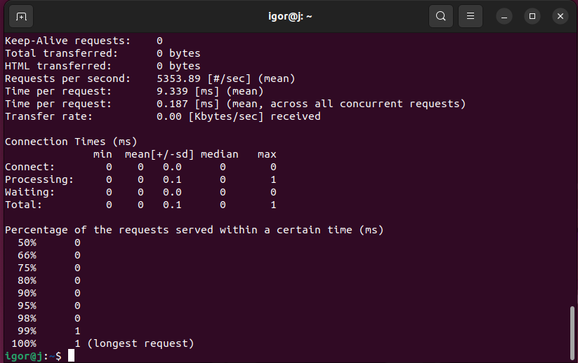

Abrindo o arquivo **test.txt** com o nano: 

>       nano test.txt

  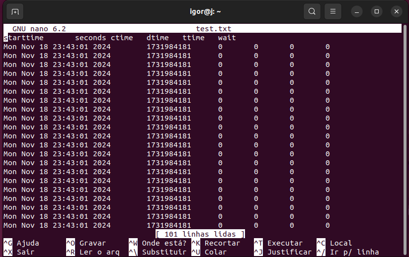

### Referências utilizadas:

- NGINX Configuration Guide: https://www.plesk.com/blog/various/nginx-configuration-guide/?authuser=1

- How To Install Nginx on Ubuntu 22.04: https://www.digitalocean.com/community/tutorials/how-to-install-nginx-on-ubuntu-22-04

- Apache Benchmark Install Ubuntu: https://bobcares.com/blog/apache-benchmark-install-ubuntu/?authuser=1

- How to Stress Test Your Website With ab (ApacheBench): https://www.inmotionhosting.com/support/edu/wordpress/performance/stress-test-with-apachebench/

## Aproveite este projeto!

Criado por **João Igor dos Santos Barbosa**.

